#### Mode bit 
 0 for kernel
1 for  user mode

*******************************************************************************

#### Threads shares  

1. Memory address space
2. Files
3. signals and their handles 

#### <mark>Threads do  not share</mark> 

1. Stack
2. Unique thread ID
3. Registers
4. Stack

*******************************************************************************

### User level vs Kernel level threads
NOTE:

1. User level threads are not recognized by kernel.
2. User level threads are dependent. Kernel level threads are independent.
3. User level threads can run one process at a time.
4. User level threads scheduling done by thread libraries while kernel level done by os.
5. for user level ---> **NO HARDWARE** support required. 
6. for kernel level --->**HARDWARE** support requiered.
7. **user level ---(fast)**
8. **kernel level ---(slow)**

## PROCESS MEMORIES 
1. STACK --->>  FUNCTION CALLS,LOCAL VARIABLES, RETURN TYPES
2. HEAP --->>  DYNAMIC MEMORY, CRETAED AT RUN TIME 
3. STATIC (DATA MEMORY) -->> GLOBAL VARIABLES , STATIC VARIABLES
4. CODE SECTION -- CODES

- PCB  implemented by DLL.

#### Process dig
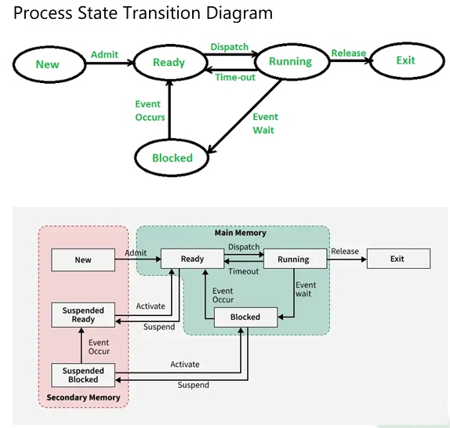

### CPU Scheduling algorithms

| Algorithms | Primitive | Starvation | Advantages | Disadvantages |
|------------|-----------|-------------|-------------|----------------|
| FCFS | NO | NO | Simple and easy to implement | **Convoy effect**, poor average waiting time |
| SJF | NO | YES| **Minimum average waiting time** | Difficult to predict burst time |
| SRJF | YES | NO | Better response time than SJF | Starvation may occur |
| LJF | NO | | Favors longer jobs | Short jobs may suffer |
| LRJF | YES | no | Useful for long process handling | High waiting time for short jobs,  Favors CPU-bound processes → not fair to
short ones |
| RR | YES | 0 | Fair CPU allocation, good response time | High context switching overhead ,Average turnaround time can
be large if q not chosen properly|
| NQ-PRIORITY | NO | yes | Simple priority handling | Low priority starvation |
| PRIORITY | YES | yes | Important tasks execute first | Starvation problem |
| MULTI-QUEUE | --| 2 | Efficient for different process types | Complex scheduling |
| MULTI FEED-QUEUE | -- | 0 | Dynamic and adaptive scheduling | Complex implementation |
| HRRN | NO | 1 | Reduces starvation | Higher computation overhead |

#### Producer-Consumer Problem
Problem: Must ensure producer does not
add to a full buffer, and consumer does not
remove from an empty buffer.
**Correct Solution** (Using Synchronization 
Tools) 
Replace busy waiting with semaphores or 
mutex + condition variables. 
Ensure: 
○ Producer waits if buffer is full.
○ Consumer waits if buffer is empty.
○ Mutual exclusion while accessing
buffer
● **mutex** → Binary semaphore.
○ Ensures mutual exclusion when
producer/consumer accesses buffer.
● **empty** → Counting semaphore.
○ Shows number of empty slots
available in buffer.
● **full** → Counting semaphore.
○ Shows number of filled slots in
buffer.

#### Monitors
Monitors (Synchronization) 
● Monitor → Language-level construct for
synchronization (compiler-supported).
Key property → At any time, only one
process can be active inside the monitor →
ensures mutual exclusion.

### imp
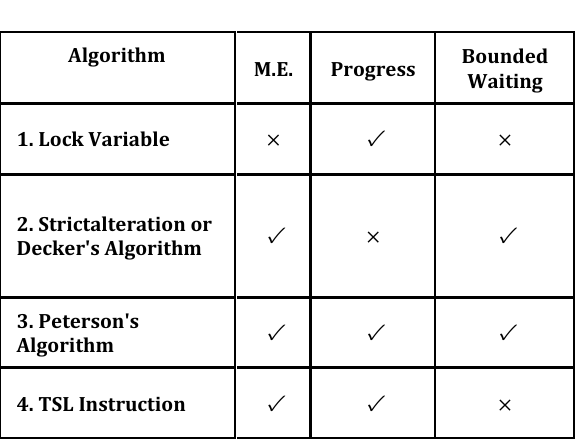

### Loading 
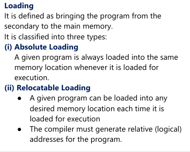

### Linking 
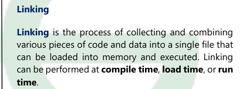

## MMT

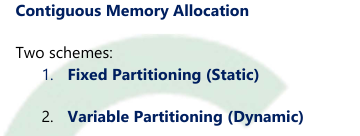
## Fixed partition 
1. Limited degree of programming
2. Internal Fragmentation

### Variable Partition
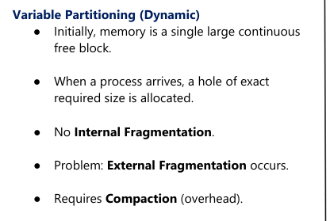

## Non - Contiguous Memory Allocation 

### 1. Paging

1. NO external fragmentation.
2. Internal fragmenation may occurs in last page only.
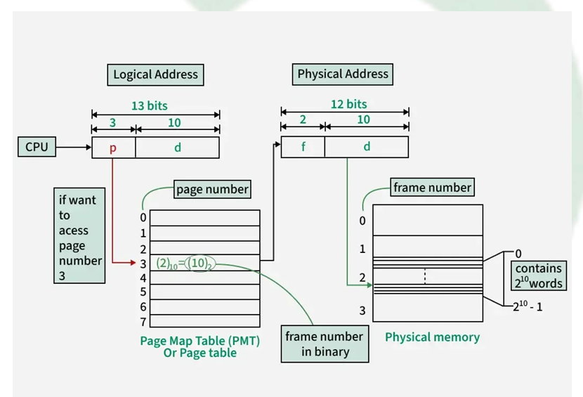

NOTE - TLB implemeted using associative registers.

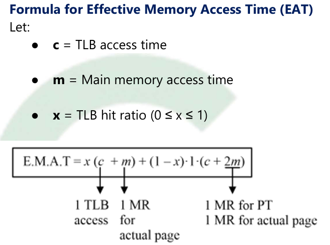
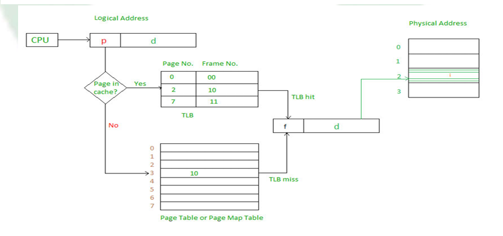

*****************************************************************

### 2.Multi level paging

1. A single-level page table may be very large
→requires huge contiguous memory.
2. To reduce this overhead, multilevel paging is
used.
3. 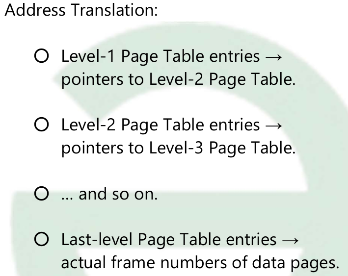

***************************************************************
Multi level paging
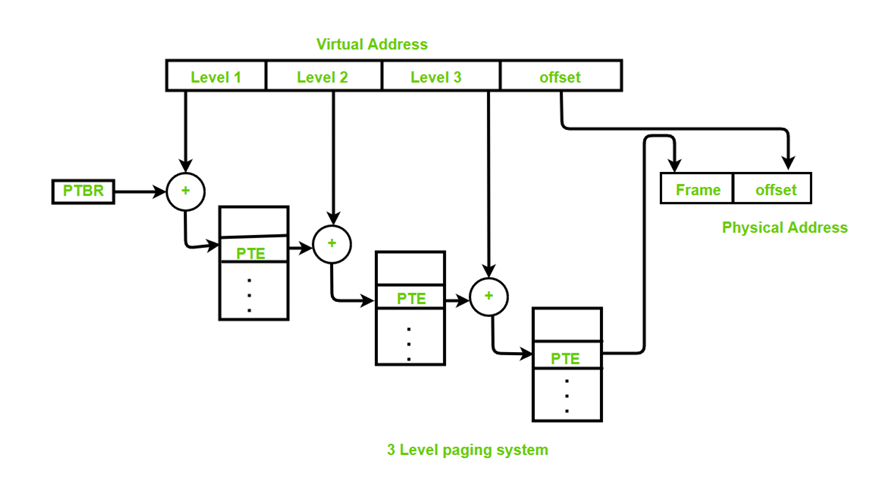

##### In multi paging , EMAT is 

### 3. Inverted Paging

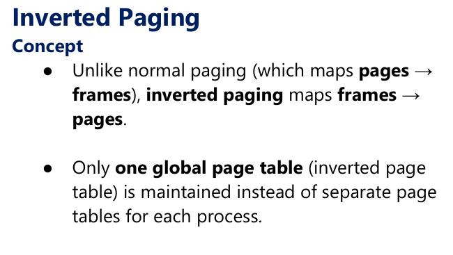

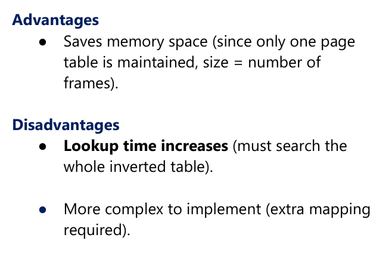

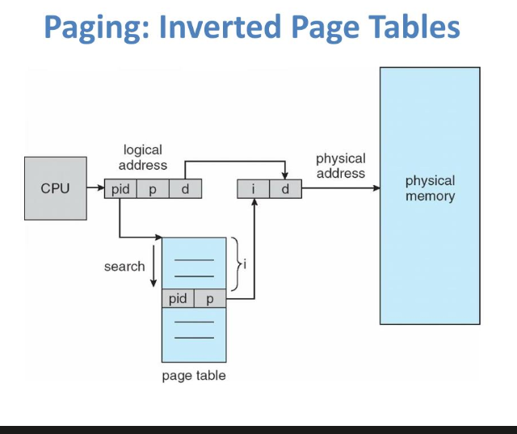

****************************************************************

### 4. Segmenatation
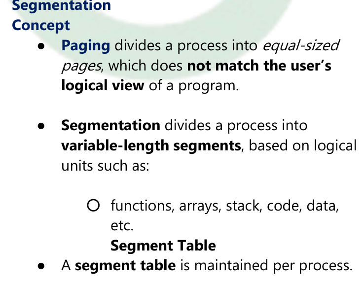
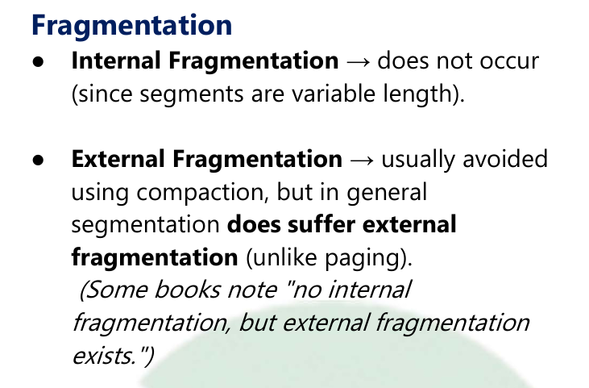
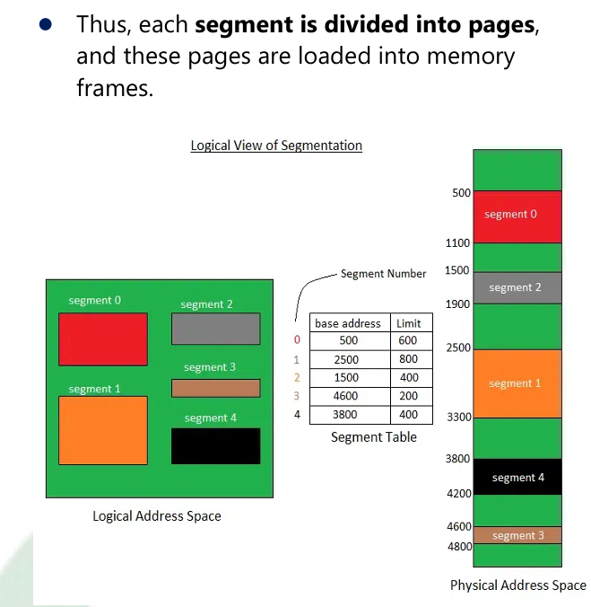

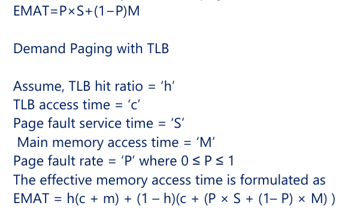

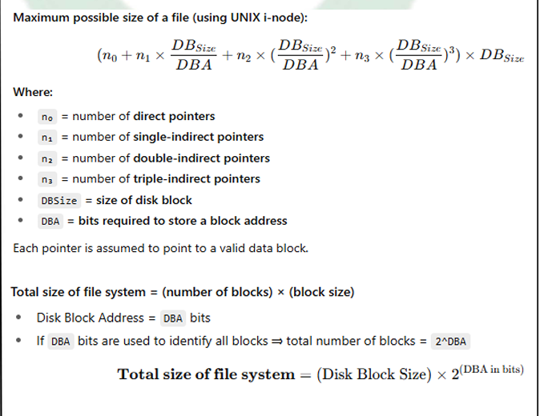

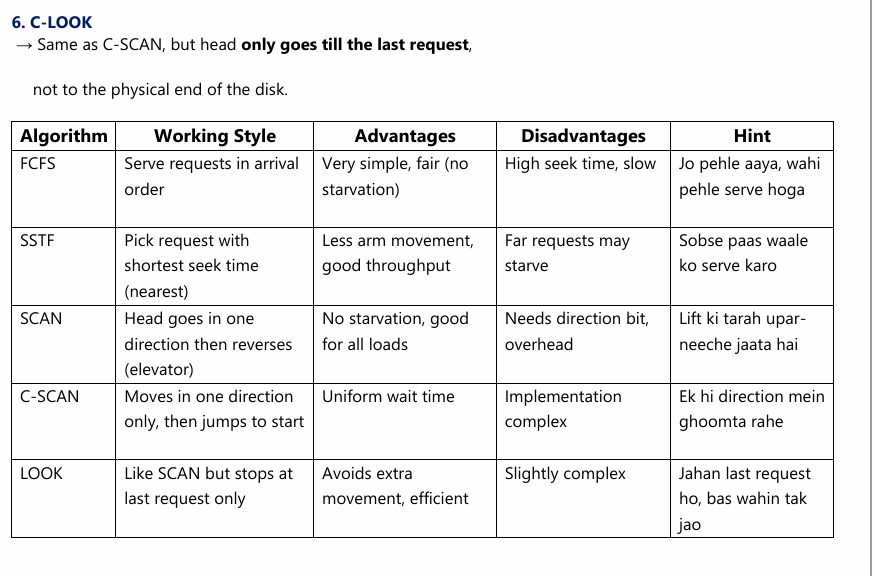
